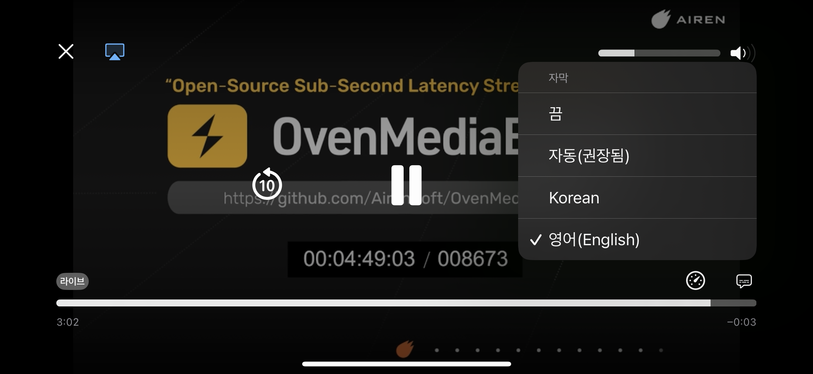

From OvenMediaEngine 0.19.1 and later, you can insert subtitles into live streams in real time using the API.





:::info

Currently, the LL-HLS and HLS publishers are supported. WebRTC will be supported in future releases.

:::


To enable subtitles, add a `Subtitles` section under `<Application>` as follows:


:::warning

The `<Subtitles>` configuration has been moved from `<Application><OutputProfiles><MediaOptions><Subtitles>` to `<Application><Subtitles>`. Please update your existing configuration accordingly.

:::


```xml
<Application>
    <Name>app</Name>
    <Type>live</Type>

    <Subtitles>
        <Enable>true</Enable>
        <DefaultLabel>Korean</DefaultLabel>
        <Rendition>
            <Language>ko</Language>
            <Label>Korean</Label>
            <AutoSelect>true</AutoSelect>
            <Forced>false</Forced>
        </Rendition>
        <Rendition>
            <Language>en</Language>
            <Label>English</Label>
        </Rendition>
    </Subtitles>
    <OutputProfiles>
        ...
    </OutputProfiles>
</Application>
```

* **DefaultLabel**: sets the default subtitle label in the player.
* **Language**: defines the language code (ISO 639-1 or ISO 639-2).
* **Label**: used to select the track when calling the API.
* **AutoSelect**: if `true`, the player may select this track automatically based on the user’s language.
* **Forced**: if `true`, the track is always shown even if subtitles are disabled (behavior depends on the player).

## Insert Subtitle Cues

Once subtitle tracks are enabled, you can insert subtitles in real time using the OvenMediaEngine subtitle API. See the API documentation for details.


[send-event-1.md](../rest-api/v1/virtualhost/application/stream/send-event-1.md)


## Late Subtitle Injection (LL-HLS Subtitle Hold Back)

Real-time transcription (e.g. speech-to-text) has an inherent processing delay: the text for a given moment in the stream is typically only ready a few seconds after that audio was actually spoken. Since [`startOffset`](../rest-api/v1/virtualhost/application/stream/send-event-1.md) is relative to the stream position at the time of the API call, a transcription pipeline often needs to insert a cue that describes audio which has already played.

For LL-HLS, the subtitle rendition's segments/parts are otherwise finalized in lockstep with the audio/video segments. Once a subtitle segment is finalized, any cue targeting a timestamp before it is dropped instead of being delivered late. `SubtitleHoldBack` delays finalization of the **subtitle rendition only** by a configurable number of milliseconds, keeping recent subtitle segments open long enough to accept cues describing already-elapsed audio.

```xml
<!-- /Server/VirtualHosts/VirtualHost/Applications/Application/Publishers -->
<Publishers>
    <LLHLS>
        <!-- Subtitle playlist lags the A/V playlist by this many milliseconds.
             Set it to comfortably cover your transcription pipeline's latency.
             Default: 0 (no hold-back, matches previous behavior). -->
        <SubtitleHoldBack>6000</SubtitleHoldBack>
    </LLHLS>
</Publishers>
```

| Element | Description |
| --- | --- |
| `SubtitleHoldBack` | Delay, in milliseconds, applied only to the subtitle rendition. Does not affect audio/video latency. Set it to at least the maximum delay you expect between a moment in the stream and the corresponding cue arriving via [`sendSubtitles`](../rest-api/v1/virtualhost/application/stream/send-event-1.md) (for example, the `StepMs`/`LengthMs` window of an [STT](./realtime-speech-to-text.md) pipeline). Default: `0` (disabled). |

:::warning

Keep `SubtitleHoldBack` comfortably below the LL-HLS DVR/retention window (`SegmentCount` × `SegmentDuration`). If it approaches or exceeds that window, a subtitle segment can be evicted before its hold-back delay elapses — any cue still waiting for that segment is dropped (a warning is logged: `SubtitleHoldBack exceeded the DVR retention window`).

:::

:::info

`SubtitleHoldBack` is part of the `<LLHLS>` publisher configuration. It applies to subtitle segments served by the LLHLS publisher, including when accessed by legacy clients (`_HLS_legacy=YES`). It has no effect on the separate classic `<HLS>` publisher.

:::

### Playlist Subtitle Disable per Playlist

When subtitles are enabled, all playlists include them by default.\
To disable subtitles for a specific playlist, set `<Playlist><Options><EnableSubtitles>` to false (default : true).

```xml
<Playlist>
	<Name>default</Name>
	<FileName>playlist</FileName>
	<Options>
		<EnableSubtitles>false</EnableSubtitles>
		...
	</Options>
```
